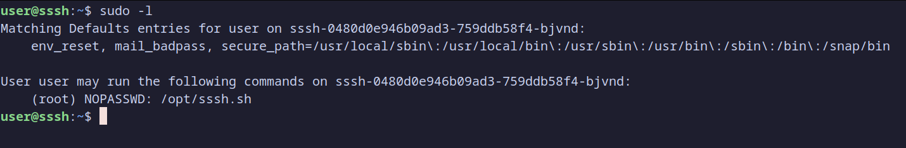
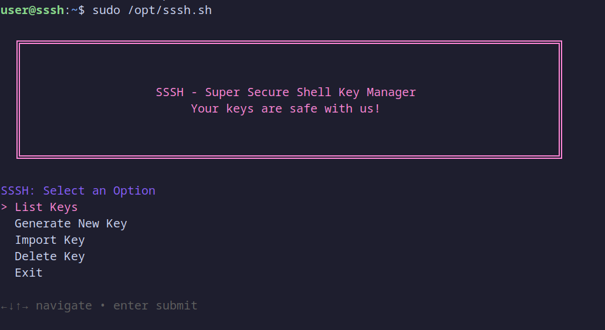
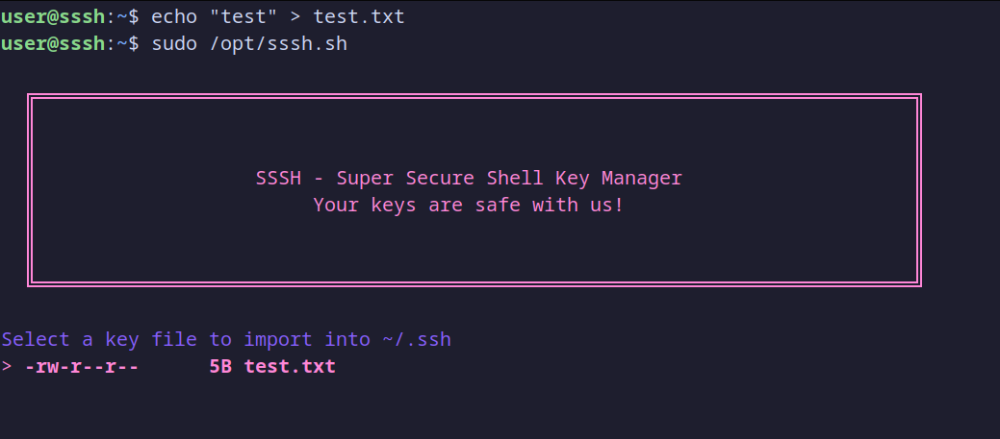
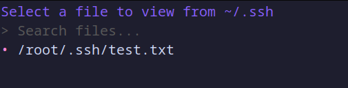
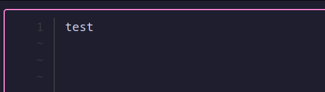
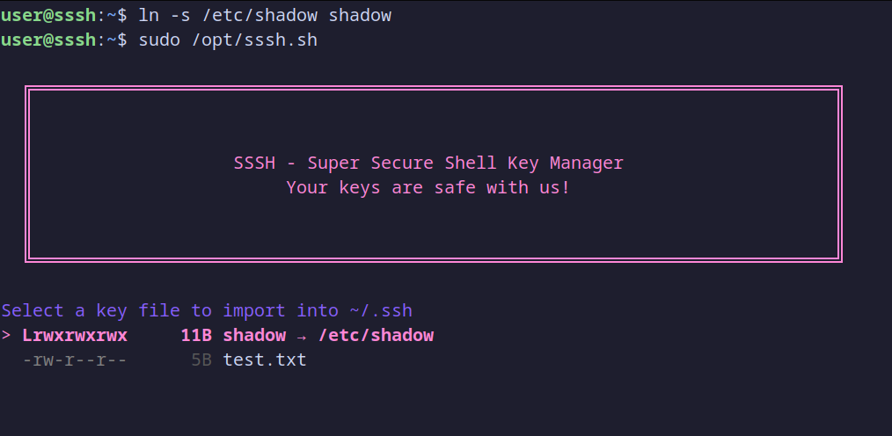
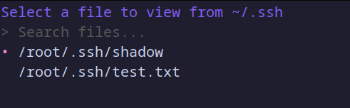

Kiểm tra các quyền

-> file /opt/sssh.sh có thể thực thi với sudo

-> chương trình có 4 chức năng chính (đọc key trong thư mục ~/.ssh/, tạo key vào thư mục ~/.ssh/, copy key vào thư mục ~/.ssh/, xóa key)

có thể kiểm tra bằng cách đọc: cat /opt/sssh.sh

Ta thử tạo 1 tệp bất kì (hoặc thư mục) rồi đọc nó (Import Key -> List Keys)

-> Ý tưởng: Vì file /opt/sssh.sh có thể chạy với sudo, nếu ta tạo các symbolink đến các tệp (hoặc thư mục) mà chỉ root mới đọc được. Sau đó Import Key rồi List Keys (sẽ lưu vào /root/.ssh/) thì sẽ đọc được các tệp đó

Thử nghiệm với tệp /etc/shadow

-> Crack mã băm SHA-512 của root (?????)

Với cách này, ta có thể đọc mọi tệp mà chỉ root mới có quyền đọc

Tuy nhiên, với tệp /root/flag.txt

-> ????? (tệp flag chỉ có thể đọc khi được thực thi bởi root chứ không thể đọc bởi root)

-> Leo thang đặc quyền lên root khi có thể đọc mọi tệp? (trừ cách crack mật khẩu của root)

Các tệp nguy hiểm khác ngoài /etc/shadow: /etc/ssh/sshd_config, /etc/sudoers...

Ý tưởng khác: thử ssh bằng key vào root (phải có quyền ghi vào tệp /etc/ssh/sshd_config???)
